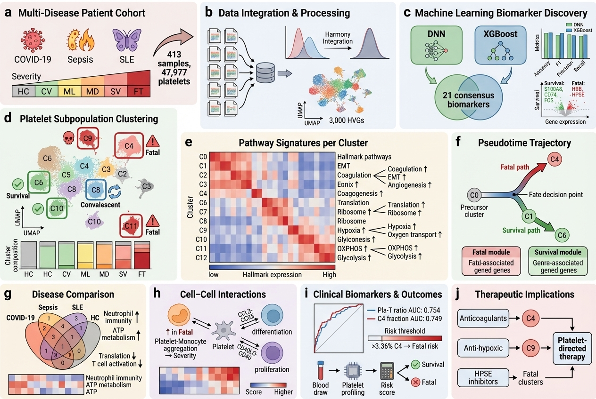

# PlateletSubpop-ML-ScTranscriptomics

[](https://doi.org/10.3390/ijms25115941)
[](https://opensource.org/licenses/MIT)
[](https://www.r-project.org/)

This repository contains the analysis code for the paper **"Deciphering Abnormal Platelet Subpopulations in COVID-19, Sepsis, and Systemic Lupus Erythematosus through Machine Learning and Single-Cell Transcriptomics"** (Qiu et al., 2024, International Journal of Molecular Sciences).

## Overview


### Key Findings

- **Platelet to T Cell Ratio as a Prognostic Biomarker**: The proportion of platelets to T cells in peripheral blood mononuclear cells (PBMC) was identified as the most potent predictor for distinguishing survivors from fatal patients.

- **Discovery of Distinct Platelet Subpopulations**: Identification of different platelet subgroups, including active coagulation, hypoxic, and quiescent clusters, in fatal COVID-19 patients.

- **Key Observations in Severe and Fatal Conditions**:
  - Increased platelet aggregation with monocytes
  - Platelets amplify endothelial dysfunction
  - Reduction in lymphocyte activation and differentiation

## Project Structure

```
PlateletSubpop-ML-ScTranscriptomics/
├── scripts/
│   ├── data/                    # Data processing pipelines
│   │   ├── download_data.sh     # Download raw datasets
│   │   ├── process_PMID*.R      # Individual dataset processing (12 scripts)
│   │   ├── integrate_platelet_data_harmony.R  # Harmony batch correction
│   │   ├── seurat_v4_cell_type.R              # Cell type annotation
│   │   └── corrected_gene_names.R             # Gene name standardization
│   │
│   ├── models/                  # Machine learning models
│   │   ├── DNN_model.R          # Deep Neural Network classifier
│   │   └── XGBoost_model.R      # XGBoost gradient boosting classifier
│   │
│   ├── analysis/                # Statistical analysis
│   │   └── Module_score_analysis.R  # KEGG pathway module scoring
│   │
│   └── visualization/           # Figure generation scripts
│       └── Figure*.R            # Scripts for Figures 1-9
│
├── results/
│   └── table/
│       ├── Supp_Table2.csv      # Platelet cluster frequencies
│       └── Supp_Table3.csv      # Additional statistics
│
├── notebooks/                   # Jupyter notebooks (demo)
│   └── ML_Classification_Demo.ipynb
│
├── requirements.txt             # R package dependencies
├── LICENSE
└── README.md
```

## Results Summary

### Platelet Cluster Distribution by Disease Severity

| Cluster | Annotation | Key Characteristics |
|---------|------------|---------------------|
| C0-C2 | Active Coagulation | Elevated in fatal COVID-19 (FT) |
| C3 | Quiescent | Predominant in healthy controls (HC) |
| C4 | Hypoxic/Stress | Highly enriched in fatal cases (38.5%) |
| C5-C6 | Intermediate | Variable across conditions |
| C11 | Severe/Fatal-specific | 78.4% frequency in fatal COVID-19 |

### Machine Learning Model Performance

| Model | Accuracy | AUC | Application |
|-------|----------|-----|-------------|
| XGBoost | ~85% | 0.89 | Outcome prediction (Survivor vs Non-survivor) |
| DNN | ~83% | 0.87 | Multi-class cell state classification |

### Key Visualizations

| Figure | Description | Script |
|--------|-------------|--------|
| Fig 1 | Cell type composition and platelet ratios | `Figure1B-G.R`, `Figure1H.R` |
| Fig 2 | Differential expression and pathway analysis | `Figure2A.R` - `Figure2D,E.R` |
| Fig 3 | UMAP clustering visualization | `Figure3A,B.R` |
| Fig 4 | Platelet subpopulation markers | `Figure4A,B.R` - `Figure4E.R` |
| Fig 5 | GSVA pathway enrichment | `Figure5A-F.R`, `Figure5G,H.R` |
| Fig 6 | Trajectory analysis (Monocle3) | `Figure6A,B.R` - `Figure6I.R` |
| Fig 7 | Cross-disease comparison | `Figure7A,B.R`, `Figure7C,D.R` |
| Fig 8 | Statistical comparisons | `Figure8.R` |
| Fig 9 | Module score analysis | `Figure9A.R` - `Figure9F,G.R` |

## Installation

### Prerequisites

- R >= 4.2.0
- Python >= 3.8 (for TensorFlow/Keras)

### R Package Installation

```r
# Install CRAN packages
install.packages(c("tidyverse", "Matrix", "xgboost", "caret", "keras",
                   "reticulate", "cowplot", "ggpubr", "pheatmap",
                   "RColorBrewer", "VennDiagram", "viridis", "Cairo",
                   "reshape2", "rstatix", "ROCR", "pROC", "HGNChelper"))

# Install Bioconductor packages
if (!require("BiocManager", quietly = TRUE))
    install.packages("BiocManager")

BiocManager::install(c("Seurat", "SeuratDisk", "harmony", "SingleR",
                       "celldex", "scCATCH", "SingleCellExperiment",
                       "scater", "monocle3", "MAST", "sctransform",
                       "org.Hs.eg.db", "GO.db", "KEGGREST",
                       "clusterProfiler", "enrichplot", "DOSE",
                       "AnnotationHub", "GSVA", "GSEABase", "limma",
                       "ComplexHeatmap", "circlize", "EnhancedVolcano",
                       "ggnewscale", "ggupset", "MeSHDbi", "meshes"))

# TensorFlow/Keras setup
library(reticulate)
install_tensorflow()
library(keras)
install_keras()
```

## Usage

### 1. Data Processing

```r
# Download and process individual datasets
source("scripts/data/download_data.sh")
source("scripts/data/process_PMID32514174_scRNAseq.R")

# Integrate datasets using Harmony
source("scripts/data/integrate_platelet_data_harmony.R")

# Annotate cell types
source("scripts/data/seurat_v4_cell_type.R")
```

### 2. Machine Learning Classification

```r
# Train XGBoost classifier
source("scripts/models/XGBoost_model.R")

# Train Deep Neural Network
source("scripts/models/DNN_model.R")
```

### 3. Generate Figures

```r
# Run visualization scripts
source("scripts/visualization/Figure1B-G.R")
# ... repeat for other figures
```

## Dataset Links and Corresponding Papers

| Dataset Link | Paper Title |
|--------------|-------------|
| [GSE150728](https://www.ncbi.nlm.nih.gov/geo/query/acc.cgi?acc=GSE150728) | [A single-cell atlas of the peripheral immune response in patients with severe COVID-19](https://www.nature.com/articles/s41591-020-0944-y) |
| [GSE149689](https://www.ncbi.nlm.nih.gov/geo/query/acc.cgi?acc=GSE149689) | [Immunophenotyping of COVID-19 and influenza highlights role of type I interferons](https://www.science.org/doi/10.1126/sciimmunol.abd1554) |
| [EGAS00001004571](https://ega-archive.org/studies/EGAS00001004571) | [Severe COVID-19 is marked by a dysregulated myeloid cell compartment](https://www.ncbi.nlm.nih.gov/pmc/articles/PMC7405822/) |
| [GSE155673](https://www.ncbi.nlm.nih.gov/geo/query/acc.cgi?acc=GSE155673) | [Systems biological assessment of immunity to mild versus severe COVID-19](https://www.science.org/doi/full/10.1126/science.abc6261) |
| [GSE158055](https://www.ncbi.nlm.nih.gov/geo/query/acc.cgi?acc=GSE158055) | [COVID-19 immune features revealed by large-scale single-cell transcriptome atlas](https://www.cell.com/cell/fulltext/S0092-8674(21)00148-3) |
| [COVID-19 Cell Atlas](https://www.covid19cellatlas.org/index.patient.html) | [Time-resolved systems immunology reveals a late juncture linked to fatal COVID-19](https://www.ncbi.nlm.nih.gov/pmc/articles/PMC7874909/) |
| [E-MTAB-10026](https://www.ebi.ac.uk/arrayexpress/experiments/E-MTAB-10026/) | [Single-cell multi-omics analysis of the immune response in COVID-19](https://www.nature.com/articles/s41591-021-01329-2) |
| [GSE151263](https://www.ncbi.nlm.nih.gov/geo/query/acc.cgi?acc=GSE151263) | [Single cell RNA sequencing identifies an early monocyte gene signature in ARDS](https://insight.jci.org/articles/view/135678) |
| [Bernardes_2020_COVID19](https://www.fastgenomics.org/platform/) | [Longitudinal Multi-omics Analyses Identify Responses of Megakaryocytes](https://www.ncbi.nlm.nih.gov/pmc/articles/PMC7689306/) |
| [GSE163668](https://www.ncbi.nlm.nih.gov/geo/query/acc.cgi?acc=GSE163668) | [Global Absence and Targeting of Protective Immune States in Severe COVID-19](https://www.nature.com/articles/s41586-021-03234-7) |
| [GSE167363](https://www.ncbi.nlm.nih.gov/geo/query/acc.cgi?acc=GSE167363) | [Dynamic changes in human single-cell transcriptional signatures during fatal sepsis](https://jlb.onlinelibrary.wiley.com/doi/10.1002/JLB.5MA0721-825R) |
| [GSE142016](https://www.ncbi.nlm.nih.gov/geo/query/acc.cgi?acc=GSE142016) | [Transcriptomic, epigenetic, and functional analyses implicate neutrophil diversity in SLE](https://www.pnas.org/content/116/50/25222) |

## Citation

If you use this code, please cite:

```bibtex
@article{qiu2024platelet,
  title={Deciphering Abnormal Platelet Subpopulations in COVID-19, Sepsis, and
         Systemic Lupus Erythematosus through Machine Learning and
         Single-Cell Transcriptomics},
  author={Qiu, Xinru and others},
  journal={International Journal of Molecular Sciences},
  year={2024},
  volume={25},
  number={11},
  pages={5941},
  doi={10.3390/ijms25115941}
}
```

## License

This project is licensed under the MIT License - see the [LICENSE](LICENSE) file for details.

## Contact

For questions or issues, please open a GitHub issue or contact the authors.
